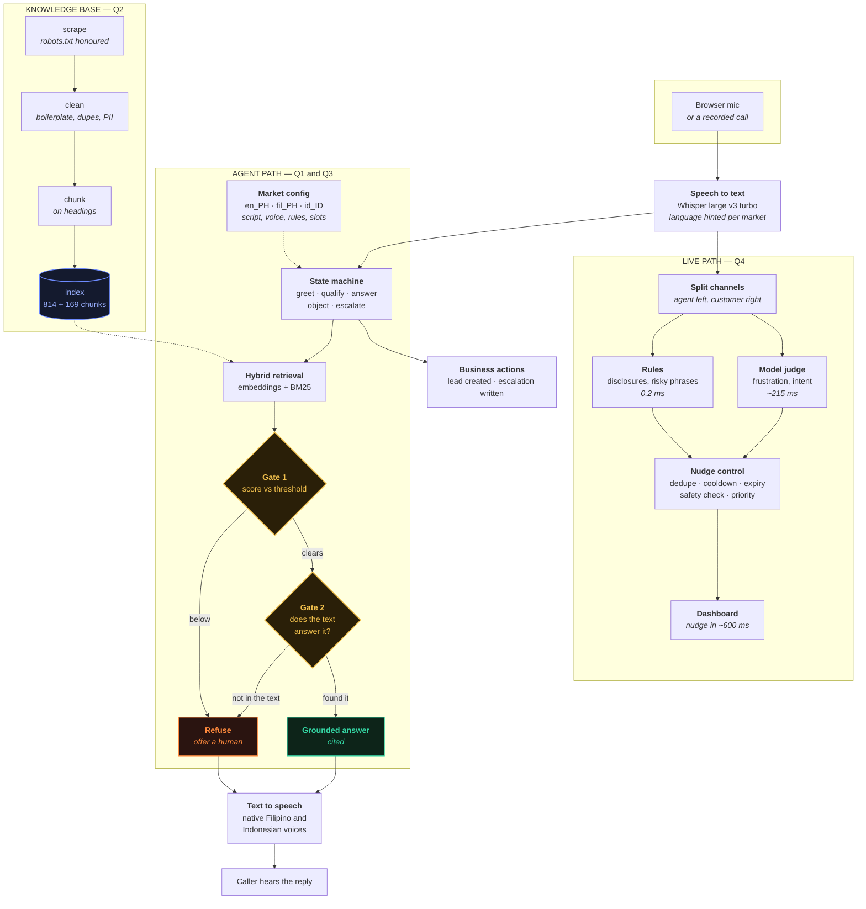
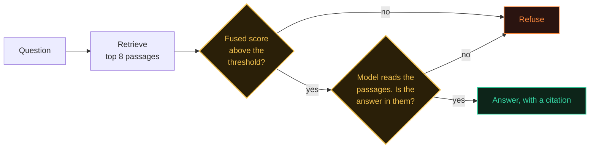
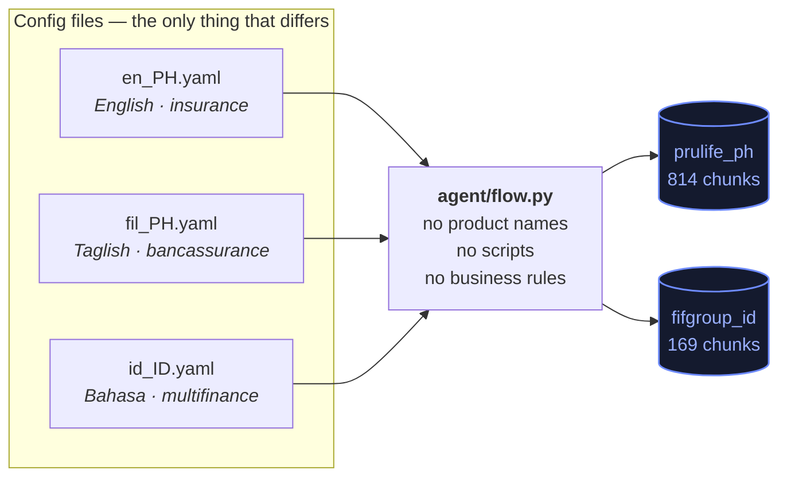

# Architecture

One voice engine. Three market configurations. Two knowledge bases. The live
nudge pipeline taps the same conversation the agent is already handling.

It runs two ways. On a recorded call it splits speakers by stereo channel and cuts
each channel into utterances with a voice activity detector - an utterance opens
when someone starts talking and closes when they pause - never looking at audio
that has not played yet. On a live call it consumes turns, where attribution is
exact: the agent's words are generated here and the caller's come back from the
transcriber already labelled. Same detectors, same suppression, same safety
check; only the segmentation differs.

That reuse is the main design decision. Q1, Q3-Philippines and Q3-Indonesia are
not three systems — they are one system reading three config files.

---

## The whole thing



---

## The two gates

This is the part worth understanding, because it is the answer to "how do you
stop it hallucinating".



Why two and not one: the scores for answerable and unanswerable questions
**overlap**. Asking for tomorrow's weather in Cebu retrieves a typhoon advisory
with a higher score than several legitimate questions about premiums, because
the vocabulary genuinely does overlap.

No threshold separates them. A score cannot read. The model can. Both are needed,
and neither is sufficient alone. The measurements are in
[`retrieval_results.md`](retrieval_results.md).

---

## One engine, three markets



Adding a fourth market is a YAML file. If it needs a different corpus, that is
one entry in `kb/sources.py`.

---

## Where the time goes

Measured, not estimated. Full numbers in
[`latency_report.md`](latency_report.md).

| Stage | Typical |
|---|---|
| Speech to text | ~550 ms |
| Retrieval | 38 ms |
| Answer generation | ~415 ms |
| Rule detectors | 0.2 ms |
| Nudge control | 0.1 ms |
| Speech synthesis | ~1,700 ms |

Speech synthesis dominates everything else by a wide margin. It is the first
thing I would replace, with a streaming voice that starts speaking before the
sentence is finished.

---

## Repository map

```
core/      shared services — model access, speech, timing
kb/        Q2 — scrape, clean, chunk, index, retrieve, answer
agent/     Q1 and Q3 — state machine, markets, actions, web server
live/      Q4 — signals, nudge control, real-time streaming
web/       the three browser consoles
scripts/   every script that produced a number in docs/
evidence/  recordings, transcripts, results
docs/      the reports those scripts generate
```
